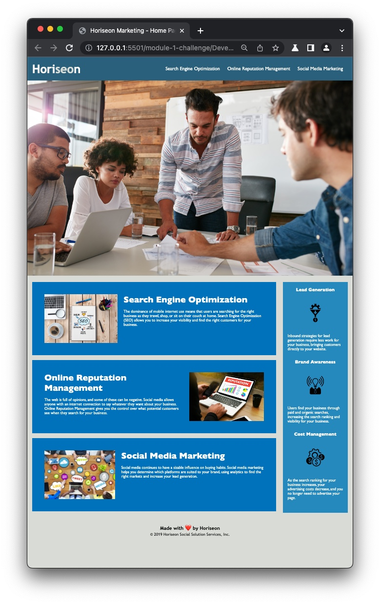

# Bootcamp Module 1 Challenge

## Description

The Horiseon Marketing page was fine visually but didn't meet the accessibility requirements. It also had unnecessary lines of code in the CSS file. Additionally, the HTML structure was difficult to read. 

These issues were solved by:

- Adding alt descriptions to all images
- Restructuring the HTML file and adding semantic elements for better readability
- Condensing the CSS code to avoid repetition 
- Added a title to the HTML file

In this project, I learned the importance of building accessible websites. I also learned why keeping the code clean and as concise as possible must be a priority.

## Mock-Up

Below is a screenshot of the page. 
Click on this [link](https://evermuniz.github.io/module-1-challenge/) to visit the deployed page.

## Credits

The original code was provided by the UofU coding bootcamp. 

## License

Refer to license in the repo

---
